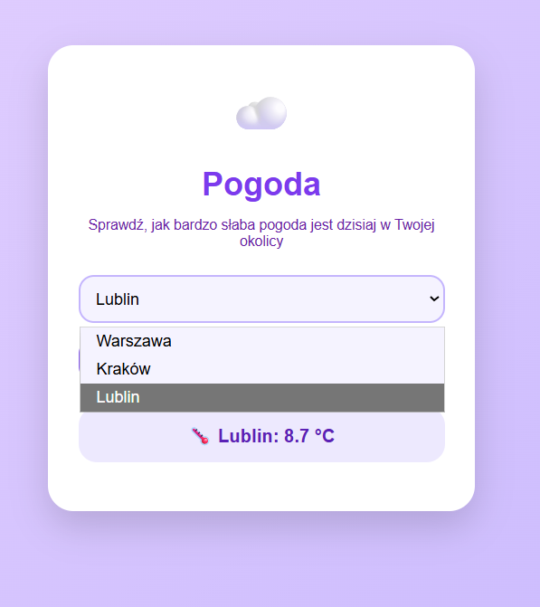
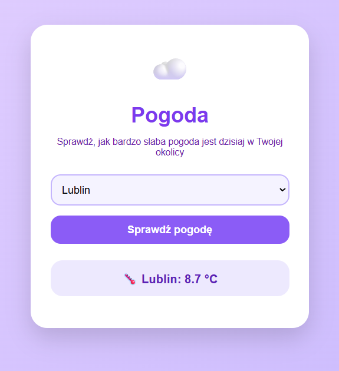
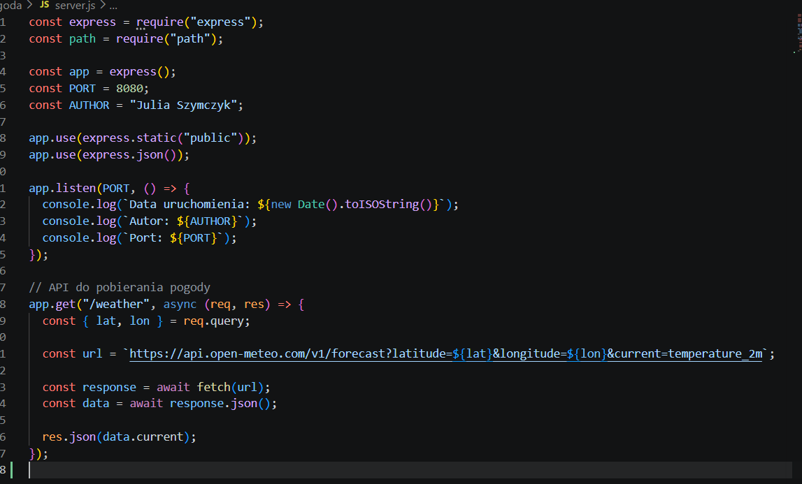
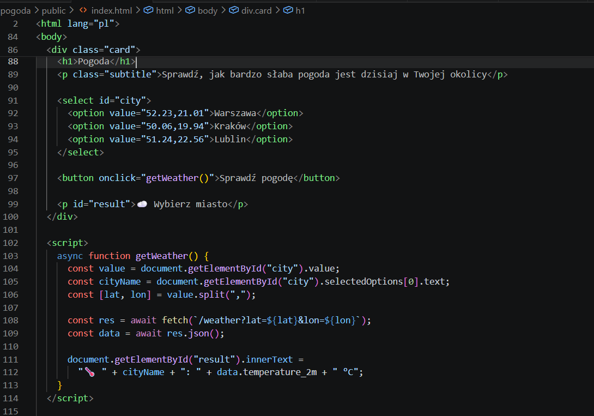
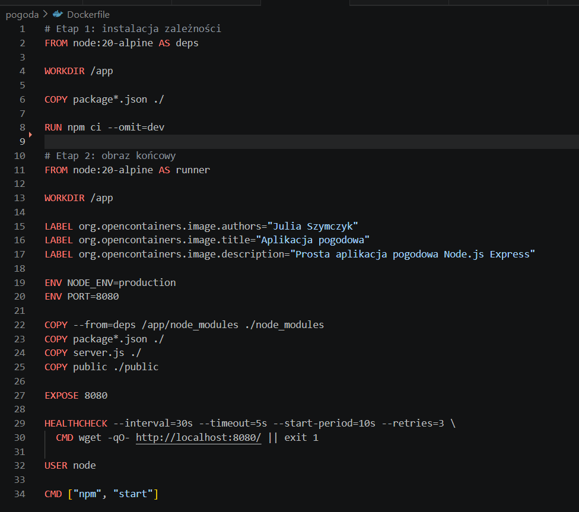
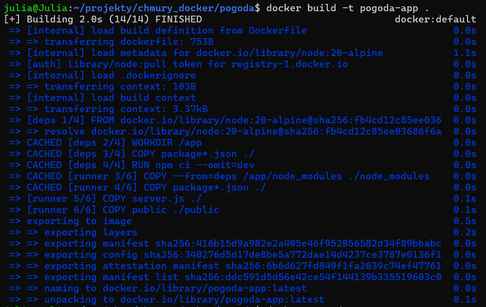
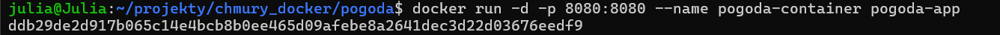
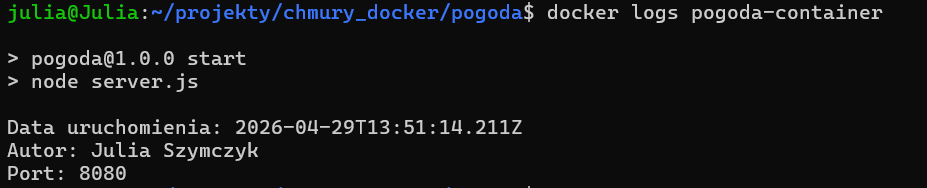
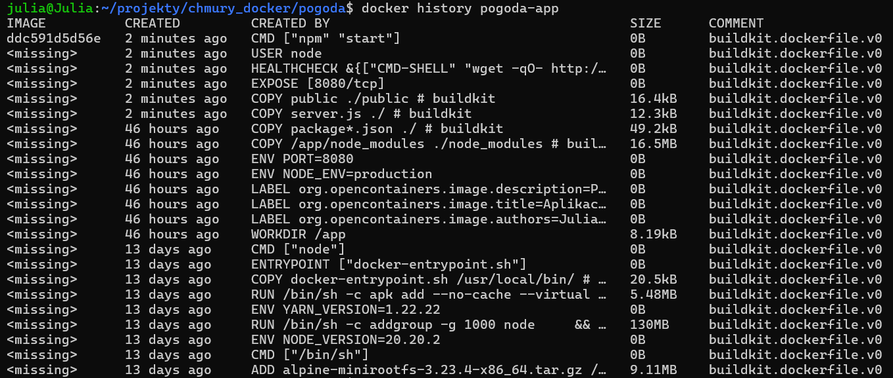
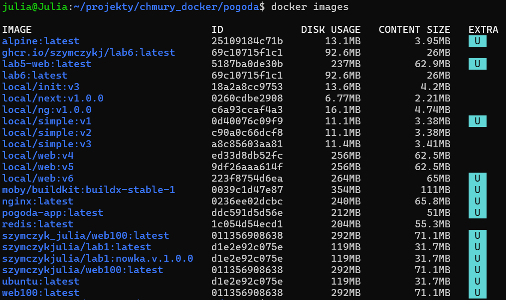

# pogoda-app

1. Część obowiązkowa:
Plik server.js odpowiada za działanie aplikacji serwerowej w Node.js (Express). Po uruchomieniu serwera wyświetlane są w logach: data uruchomienia, autor oraz port, co spełnia wymaganie punktu a. Aplikacja udostępnia endpoint /weather, który przyjmuje współrzędne miasta i pobiera aktualną pogodę z API Open-Meteo, a następnie zwraca ją do klienta. Dane są wyświetlane w interfejsie użytkownika.

Plik index.html stanowi interfejs użytkownika aplikacji. Zawiera prosty formularz umożliwiający wybór miasta z listy rozwijanej oraz przycisk do pobrania danych pogodowych. Po kliknięciu przycisku wywoływana jest funkcja getWeather(), która pobiera współrzędne wybranego miasta, wysyła zapytanie do endpointu /weather, a następnie odbiera dane pogodowe w formacie JSON. Otrzymana temperatura jest wyświetlana na stronie wraz z nazwą miasta, co umożliwia użytkownikowi szybkie sprawdzenie aktualnej pogody.

Dockerfile:

##Polecenia Docker
a. Polecenie do zbudowania obrazu kontenera:
docker build -t pogoda-app .

b. Polecenie do uruchomienia kontenera:
docker run -d -p 8080:8080 --name pogoda-container pogoda-app

c. Polecenie do odczytu logów aplikacji:
docker logs pogoda-container

d. Polecenia do sprawdzenia liczby warstw i rozmiaru obrazu:
Sprawdzenie ilości warstw:
docker history pogoda-app

Polecenie do sprawdzenia rozmiaru:
docker images

